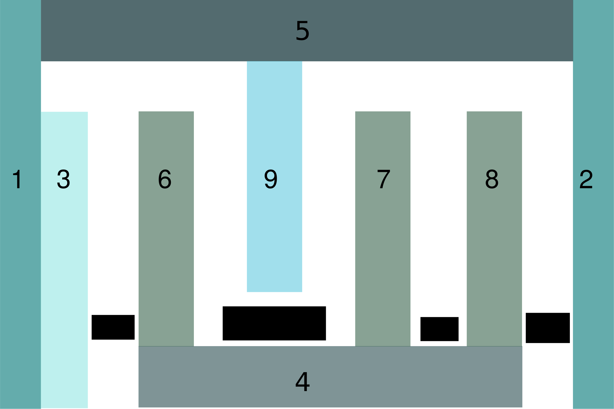

# tum-logo
A cool simulation using the phiflow differentiable fluid solver.

You can find and use phiflow here: https://github.com/tum-pbs/PhiFlow/ 

The obstacles created in the code are numbered the legend below. The black boxes denote inflows and the white spaces are empty domain. Same colored boxes are same sized obstacles.

## 2D Version

## 3D Version

The 3D version was rendered using the open-source free software [Blender](https://www.blender.org/). More details on the rendering process and setup soon.